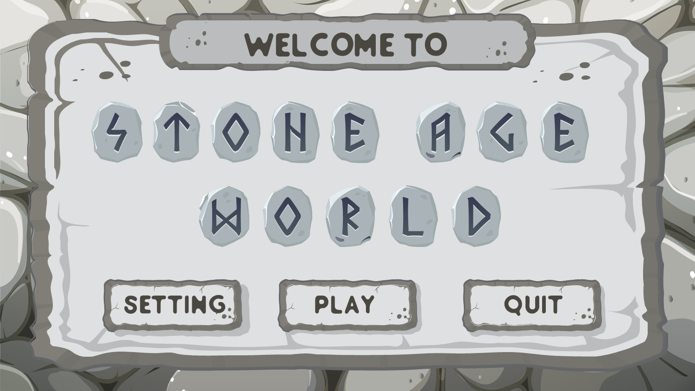

## About This Project
This is a learning project developed in Unity 6, focusing on implementing core 2D platformer mechanics in a stone age themed environment. The project serves as a practical study of game development concepts including player movement, physics interactions, and level design.

## Features
- Classic 2D platformer mechanics
- Stone Age themed environments and assets
- Player character with full movement control
- Universal Render Pipeline (URP) for enhanced visuals
- Input System integration for responsive controls

## Technical Stack
- Engine: Unity 6
- Graphics: Universal Render Pipeline (URP)
- Input: New Input System
- Platform: Windows

## Project Structure
- `Assets/2D_STONE AGE WORLD/` - Main game assets and resources
- `Assets/Animation/` - Character and object animations
- `Assets/Scenes/` - Game scenes and levels
- `Assets/Script/` - Game scripts and logic
- `Assets/TileMaps/` - Level design tile assets
- `Assets/UI/` - User interface elements

## Setup Instructions
1. Clone this repository
2. Open the project in Unity (recommended version: [Unity Version])
3. Open the main scene from `Assets/Scenes/`
4. Press Play to test the game

## Controls
- Arrow Keys / WASD: Move left/right
- Space: Jump
- Additional controls will be added as development progresses

## Development Status
This is a study project under active development. Features and mechanics are being added as learning progresses.

## Credits
- Stone Age World assets from [2D Stone Age World Platformer Starter Kit](https://assetstore.unity.com/packages/2d/environments/2d-stone-age-world-platformer-starter-kit-86769)

## License
This project is licensed under the MIT License - see the [LICENSE](LICENSE) file for details

## Learning Goals
- Implementation of 2D platformer mechanics
- Understanding Unity's physics system
- Level design principles
- Game development best practices
- Input system implementation

---
*This is a learning project created for educational purposes.*